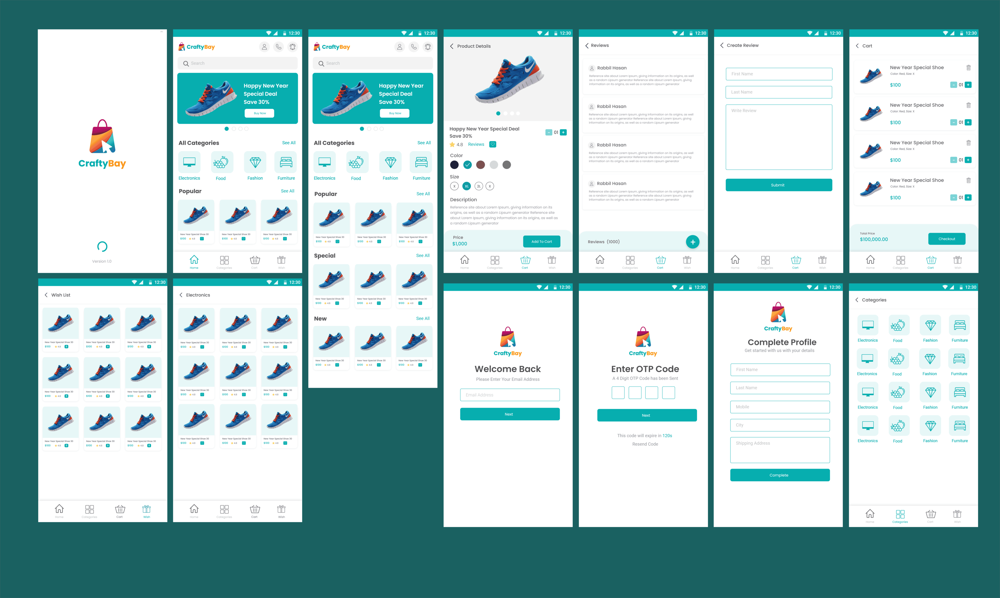

# 🛍️ Flutter eCommerce App

A **complete eCommerce mobile application** built with **Flutter** using **GetX state management** and **REST API integration**.  
This project provides a real-world shopping experience with features like user authentication, product listing, cart management, checkout, and secure payment via WebView.

---

## 🚀 Overview

This Flutter eCommerce app demonstrates:
- REST API integration for fetching and managing data
- Scalable GetX architecture (Controllers, Bindings, and Routes)
- Authentication (Login, Signup, Email & OTP Verification)
- Smooth shopping flow (Product listing → Details → Add to Cart → Checkout → Payment)
- Wishlist and Profile management
- Beautiful UI and responsive layout for different screen sizes

---

## 💡 Key Features

| Category | Features |
|-----------|-----------|
| **Authentication** | User Login, Signup, Email verification, OTP verification |
| **Product Management** | Browse products, View product details, Category filtering |
| **Cart & Wishlist** | Add to cart, Update or remove items, Add to wishlist |
| **Checkout & Payment** | Checkout process with order summary, Payment via WebView |
| **Profile Management** | User profile view and update |
| **State Management** | Implemented with GetX (Controller, Binding, Routing) |
| **API Integration** | Fully connected with backend REST APIs |

---

## 📱 App Screens

| Screen | Description |
|---------|--------------|
| **Splash Screen** | App initialization and logo display |
| **Login Screen** | User login with REST API |
| **Signup Screen** | Create new user account |
| **Email Verification Screen** | Send verification mail |
| **OTP Verification Screen** | Verify user with one-time code |
| **Home Screen** | Display latest and featured products |
| **Category Screen** | View products by category |
| **Product List Screen** | Browse all products |
| **Product Details Screen** | View detailed product info and add to cart |
| **Cart List Screen** | Manage cart products and proceed to checkout |
| **Wishlist Screen** | Save favorite products for later |
| **Checkout Screen** | Review order summary and payment options |
| **Payment WebView** | Web-based secure payment |
| **Profile Screen** | View and edit user profile |

---

## 🧩 Tech Stack

| Component | Technology                           |
|------------|--------------------------------------|
| **Framework** | Flutter                              |
| **Language** | Dart                                 |
| **State Management** | GetX                                 |
| **API Communication** | REST API (http)                      |
| **Local Storage** | GetStorage / SharedPreferences       |
| **Authentication** | Email & OTP verification             |
| **Payment Integration** | WebView                              |
| **Architecture** | Clean structure (MVC / MVVM pattern) |

